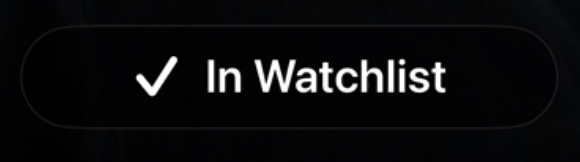
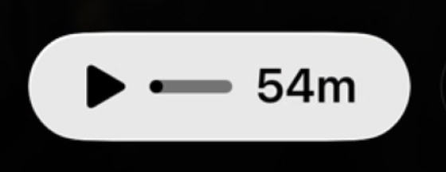

# Button Style Spec

This spec is platform-agnostic and intended to be reproducible in any UI framework.

## Default style

Use these defaults for all button variants unless overridden by a specific variant section.

- Base size token: `H` (recommended reference: `72px`).
- Shape model:
  - Pill: corner radius `H/2`.
  - Circle: corner radius `50%` (or a very large radius token).
- Visual treatment:
  - Flat rendering (no gradient).
  - No drop shadow or glow.
  - Background context assumed to be dark (`#000000`) for contrast tuning.
- Border rendering:
  - Crisp 1-2 px stroke.
  - Anti-aliased edges.
- Icon rendering:
  - Rounded stroke caps and joins for stroked icons.
  - Center-aligned both horizontally and vertically.

## Focused style

Use for the active/primary state (example: play button with label and icon).

- Shape: pill/capsule.
- Size behavior:
  - Height: `H`.
  - Width: content-based with generous horizontal inset.
- Fill:
  - Opaque light neutral gray.
  - Suggested range: `#E7E7E9` to `#ECECEF`.
- Border:
  - None, or optional subtle edge: `1px solid rgba(255, 255, 255, 0.10-0.18)`.
- Content:
  - Includes leading icon and text label.
  - Icon and text color: near-black (`#050505` to `#111111`).
- Typography:
  - Clean sans-serif.
  - Weight `500-600`.
  - High legibility at the chosen `H`.
- Icon details:
  - Play icon uses a filled triangle (not stroked).
  - Icon box target: about `0.42 * H`.

## Icon-only variant

Use for inactive/secondary controls when only an icon is shown.

- Shape: circle.
- Size: `H x H`.
- Fill:
  - Dark transparent ghost fill.
  - Suggested: `rgba(0, 0, 0, 0.18-0.30)` or fully transparent on pure black surfaces.
- Border:
  - Light white transparent stroke.
  - Suggested: `1-2px solid rgba(255, 255, 255, 0.08-0.16)`.
- Icon:
  - No text label.
  - White or near-white (`rgba(255, 255, 255, 0.90-1.00)`).
  - Scale target: `0.38 * H` to `0.44 * H`.
- Visual hierarchy:
  - Lower emphasis than focused style through reduced fill contrast and translucent border.
